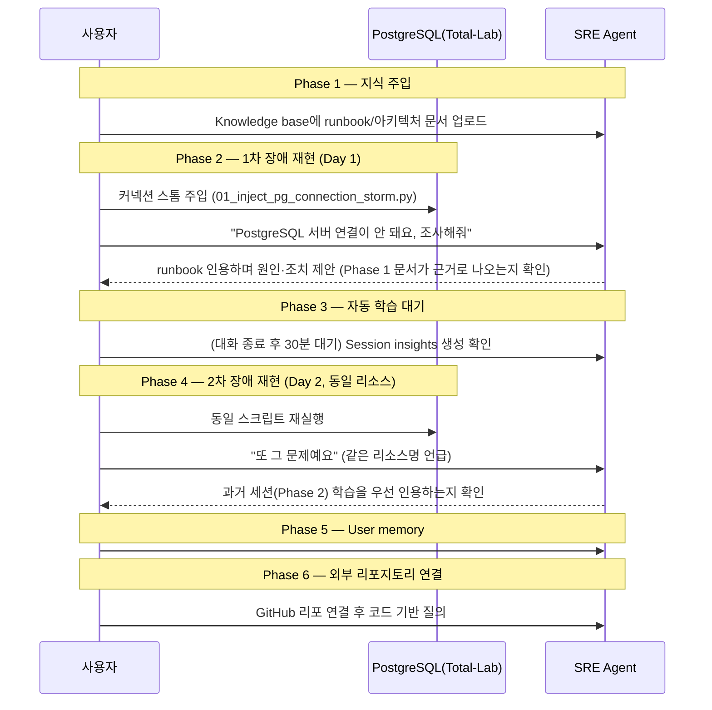

# SRE Agent "지식(Knowledge)" 기능 테스트랩 (knowledge-lab)

`Total-Lab/full-lab`에 이미 배포된 리소스(`rg-diag-total-lab`: PostgreSQL/MySQL/SQL PaaS,
Windows/Linux VM, Log Analytics)를 **그대로 재사용**하여, Azure SRE Agent의 지식/메모리 3대 기능을
검증하기 위한 랩입니다. **인프라를 새로 배포하지 않습니다.**

검증 대상 기능 (Microsoft Learn `sre-agent/memory`, `sre-agent/connect-knowledge` 기준):

| 기능 | 설명 |
|---|---|
| **Knowledge base** | Runbook/아키텍처 문서 업로드 → 대화 중 인용(citation)과 함께 참조 |
| **User memories** | `#remember` / `#retrieve` / `#forget` 채팅 명령으로 개별 사실 저장·조회·삭제 |
| **자동 학습(Session insights)** | 스레드 종료 30분 후 자동으로 증상/해결단계/근본원인 추출 → 동일 리소스 재장애 시 우선 참조 |
| **외부 연결** | GitHub/ADO 리포지토리·wiki 연결 → 코드/문서 기반 답변 |

---

## 사전 준비

1. `Total-Lab/full-lab`이 배포되어 있고 `lab-credentials.local.txt`가 있어야 합니다(없으면 먼저
   `00_deploy.ps1`로 배포).
2. Azure SRE Agent가 생성되어 있고, 해당 구독/`rg-diag-total-lab`에 대한 읽기 권한이 있어야 합니다.
3. (선택, Phase 6용) GitHub에서 `FactoryKor` 조직 리포(예: `pg`) 또는 사내 ADO wiki에 대한 접근 권한.
4. 이 폴더의 주입 스크립트 실행용 Python 패키지 설치:
   ```powershell
   cd knowledge-lab\inject-scenarios
   pip install -r requirements.txt
   ```

> ⚠️ 비용/영향: 이 랩은 기존 PaaS DB에 다수의 연결을 열거나(커넥션 스톰) 잠깐 동안 행(row) 잠금을
> 유지합니다. **테스트 랩 전용 DB**에서만 실행하세요. 운영 DB에는 절대 사용하지 마세요.

---

## 시나리오 개요



---

## Phase 1 — Knowledge base 문서 업로드

1. Azure Portal → SRE Agent → **Builder > Knowledge base**로 이동.
2. `knowledge-base-docs/` 폴더의 4개 파일을 업로드:
   - `architecture-overview.md` — Total-Lab 토폴로지 (일부러 정확한 서버명/IP/역할을 적어둠 → 에이전트가
     이 문서를 인용해서 답하는지 확인하는 용도)
   - `postgresql-connection-exhaustion-runbook.md` — PostgreSQL 커넥션 고갈 대응 절차
   - `mysql-lock-contention-runbook.md` — MySQL 잠금 경합 대응 절차
   - `escalation-procedures.md` — 온콜 에스컬레이션 순서
3. **Status**가 `Indexed`로 바뀔 때까지 기다립니다(포털에서 상태 확인).
4. 검증 프롬프트(채팅에 입력):
   ```
   지금 어떤 지식 문서를 가지고 있어?
   ```
   업로드한 4개 문서가 이름과 함께 나오면 성공입니다.

---

## Phase 2 — 1차 장애 재현 (Day 1, 지식 활용 확인)

1. PostgreSQL에 커넥션 스톰 주입:
   ```powershell
   $env:KLAB_PG_PASSWORD = "<lab-credentials.local.txt의 diagadmin 비밀번호>"
   python 01_inject_pg_connection_storm.py `
     --host <postgresqlPaasFqdn> --dbname diagdb --user diagadmin `
     --connections 80 --hold-seconds 600
   ```
   스크립트가 80개 연결을 열고 10분간 유지합니다(Flexible Server Burstable SKU 기준 `max_connections`
   근접/초과 유발).
2. 스크립트가 실행 중인 동안 SRE Agent 채팅에 입력:
   ```
   rg-diag-total-lab의 PostgreSQL 서버 연결이 갑자기 안 됩니다. 원인을 조사하고 조치를 제안해줘.
   ```
3. **확인 포인트**:
   - 응답에 업로드한 `postgresql-connection-exhaustion-runbook.md` 인용(citation 링크)이 포함되는가?
   - 제안된 조치가 runbook에 적힌 절차(예: idle 연결 종료, `max_connections` 조정)와 일치하는가?
4. 대화를 마무리하고(추가 질문 없이) **30분 이상 그대로 둡니다** — 자동 학습(Session insight) 생성 대기.

---

## Phase 3 — 자동 학습(Session insights) 생성 확인

1. Azure Portal → SRE Agent → **Monitor > Session insights**로 이동.
2. Phase 2 스레드에서 생성된 인사이트 카드를 확인:
   - 증상(symptoms), 해결 단계(resolution steps), 근본 원인(root cause)이 추출되었는지
   - 카드에서 원본 스레드로 링크되는지(Source thread link)

---

## Phase 4 — 2차 장애 재현 (Day 2, 동일 리소스 우선순위 확인)

1. 같은 서버에 커넥션 스톰을 **다시** 주입(스크립트 재실행, 파라미터 동일).
2. 새 대화창에서:
   ```
   rg-diag-total-lab PostgreSQL 서버가 또 연결이 안 돼요.
   ```
3. **확인 포인트**: 에이전트가 "이 리소스에서 전에 본 문제"라며 Phase 2 세션 학습을 먼저 언급하는가?
   (Same-resource priority 동작 확인 — 문서 `sre-agent/memory`의 핵심 기능)
4. 정리: `python 01_inject_pg_connection_storm.py --connections 0` 또는 Ctrl+C로 조기 종료해도
   스크립트의 `finally` 블록이 모든 연결을 정리합니다.

---

## Phase 5 — User memory (`#remember` / `#retrieve` / `#forget`)

채팅에 순서대로 입력하며 확인:

```
#remember rg-diag-total-lab의 PostgreSQL 서버는 Burstable SKU라서 max_connections가 낮게 설정되어 있다
#remember 이 랩의 온콜 순서는 Slack #diag-lab-oncall 채널 → 담당자 직접 연락 순서다
```
```
#retrieve 이 PostgreSQL 서버의 커넥션 제약이 뭐였지?
```
→ 저장한 사실(Burstable SKU, max_connections 낮음)을 그대로 답하는지 확인.
```
#forget 온콜 순서 관련 기억
```
```
#retrieve 온콜 순서가 뭐였지?
```
→ 삭제 후에는 더 이상 그 정보를 답하지 않아야 정상입니다.

---

## Phase 6 — 외부 리포지토리 연결 (선택)

1. Azure Portal → SRE Agent → **Builder > Connectors**에서 GitHub 연결.
2. `FactoryKor/pg`(또는 접근 가능한 진단 도구 리포) 리포지토리를 지식 소스로 추가.
3. 인덱싱 완료 후 질의:
   ```
   pg_diagnose 도구는 커넥션 고갈을 어떤 지표/쿼리로 탐지해?
   ```
4. **확인 포인트**: 응답이 실제 코드(`pg_diagnose.py`의 연결 수 체크 로직)를 근거로 인용하는가?

---

## MySQL 잠금 경합 시나리오 (보조 시나리오)

PostgreSQL과 별개로, MySQL PaaS 서버에서도 동일한 4단계(Knowledge → 1차 장애 → 자동학습 →
2차 장애)를 반복하고 싶다면:

```powershell
$env:KLAB_MYSQL_PASSWORD = "<lab-credentials.local.txt의 diagadmin 비밀번호>"
python 02_inject_mysql_lock_contention.py `
  --host <mysqlPaasFqdn> --dbname diagdb --user diagadmin `
  --hold-seconds 300 --waiters 5
```

`mysql-lock-contention-runbook.md`를 Knowledge base에 올려둔 뒤 위와 동일한 절차를 따르세요.

---

## 평가표 (체크리스트)

| # | 항목 | 통과 기준 |
|---|---|---|
| 1 | Knowledge base 인덱싱 | 업로드한 4개 문서가 `Indexed` 상태 |
| 2 | 문서 인용 | 1차 장애 조사 응답에 runbook citation 포함 |
| 3 | Session insight 생성 | Monitor에서 증상/원인/해결단계 카드 확인 |
| 4 | 동일 리소스 우선순위 | 2차 장애 시 "전에 본 문제" 언급 |
| 5 | `#remember`/`#retrieve` | 저장한 사실을 정확히 재생산 |
| 6 | `#forget` | 삭제 후 해당 정보 응답에서 제외 |
| 7 | 외부 리포 연결(선택) | 코드 기반 citation 포함 응답 |

모든 항목을 스프레드시트나 표로 기록해두면 이후 다른 SRE Agent 랩(예: incident-response 랩)에도
재사용할 수 있습니다.
